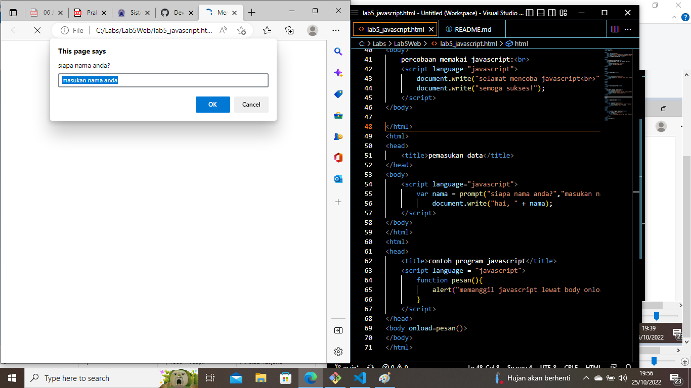

# Lab5Web
## Javascript
### Langkah - langkah Pratikum 5

#### Membuat Dokumen HTML
Dengan menambahkan (document.write dan console.log) untuk membuat dokumen HTML, menulis ke dalam output HTML dan ke konsol browser. Beginilah tampilannya:

#### Membuat Javascript Dasar
Pemakaian Alert sebagai property window.. Inilah tampilannya:

#### Pemakaian Prompt
Inilah tampilannya:

#### Cara Memanggil Prompt
dengan menambahkan alert. berikut tampilannya :

#### Pembuatan Dasar Pemrograman Di Javascript (Aritmatika)
Dengan menambahkan document.write.  Berikut tampilannya:

#### Seleksi kondisi (if..else)
Dengan menambahkan document.write pada else . Berikut tampilannya:

#### Hasil Pratikum Pembuatan Form dan HTML DOM, 
Berikut ini adalah tampilan dari praktek yang saya lakukan:

